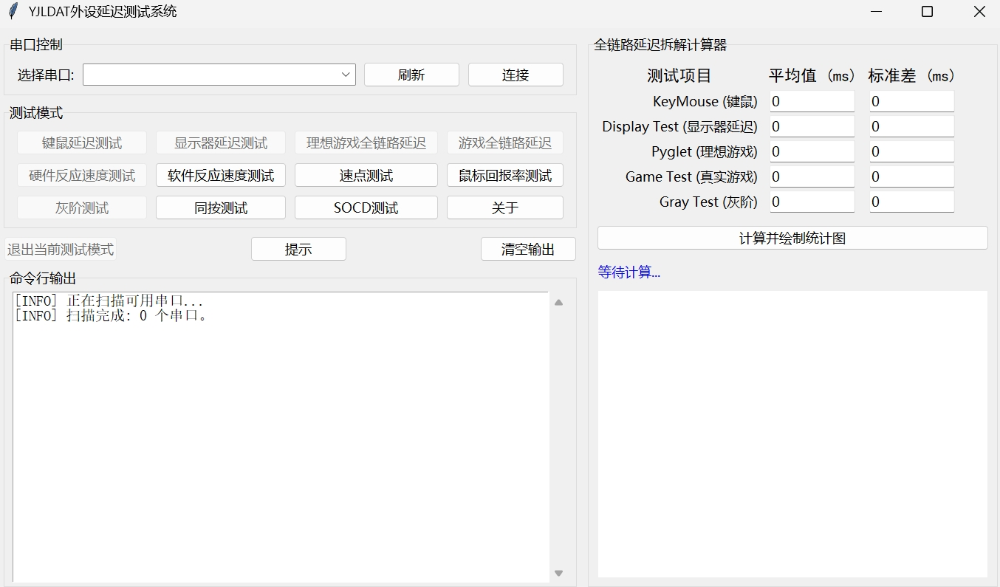

# 云居延迟与显示分析工具（YJLDAT）

[English](./README.md) | 中文文档



**YJLDAT**（Yunju Latency and Display Analysis Tool，云居延迟与显示分析工具）是一套用于电脑外设、显示器与游戏端到端延迟分析的低成本、高精度测量工具。

本项目包含 Windows 上位机 GUI 程序，以及配合 RP2040 微控制器使用的固件，用于测量：

- 鼠标/键盘输入延迟
- 显示器响应延迟
- Pyglet 基准环境端到端延迟
- 游戏实际端到端延迟
- 鼠标回报率
- 快速连点、SOCD、反应测试等外设行为

> 本项目相关技术方案已获得中国发明专利授权。  
> 专利号：`ZL 2026 1 0104896.0`

---

## 功能特性

- 基于物理触发的输入延迟测量
- 光敏传感器检测屏幕亮度变化
- 支持外设、显示器、游戏全链路延迟拆解
- 支持动态光照环境下的显示响应测试
- 支持统计平均值、标准差等稳定性分析
- 支持低成本硬件搭建
- 图形化 Windows 操作界面

---

## 安装说明

### 方式一：下载预编译文件（推荐）

访问 [Releases](https://github.com/yunjuyihao/YJLDAT/releases) 页面下载：

- `YJLDAT_GUI_V1.9.exe` - Windows GUI 应用程序（无需安装 Python）
- `unified_firmware.uf2` - RP2040 预编译固件

**固件安装步骤：**

1. 按住 RP2040 开发板上的 `BOOTSEL` 按钮
2. 保持按住的同时，用 USB 线连接开发板到电脑
3. 开发板会显示为一个 USB 存储设备（如 `RPI-RP2`）
4. 将 `unified_firmware.uf2` 拖放到该存储设备中
5. 开发板会自动重启

**GUI 使用：**

1. 下载 `YJLDAT_GUI_V1.9.exe`
2. 直接运行，无需安装

---

### 方式二：从源码构建

**环境要求：**

- Python 3.8+
- Arduino IDE（用于固件编译）

**步骤：**

1. 克隆本仓库：
   ```bash
   git clone https://github.com/yunjuyihao/YJLDAT.git
   cd YJLDAT
   ```

2. 安装 Python 依赖：
   ```bash
   pip install -r requirements.txt
   ```

3. 运行 GUI：
   ```bash
   python YJLDAT_GUI_V1.9.py
   ```

4. （可选）编译固件：
   - 在 Arduino IDE 中打开 `unified_firmware/unified_firmware.ino`
   - 选择开发板：`Raspberry Pi Pico` 或 `Raspberry Pi Pico 2`
   - 编译并上传

---

## 硬件要求

**基础硬件：**

- RP2040 开发板
- 双头鳄鱼夹线
- 铜箔胶带
- 光敏二极管 / 光敏传感器模块
- 杜邦线若干
- Windows PC

**典型接线方式：**

```text
GP16 → 鳄鱼夹 → 铜箔胶带 → 待测外设按键表面

USB 接口外壳 / GND → 鳄鱼夹 → 手持接地

GP26 → 光敏传感器 AO
3.3V → 光敏传感器 VCC
GND  → 光敏传感器 GND
```

**提示：** 建议将 GP17 套上空杜邦母头，避免 GP16 鳄鱼夹误触。

---

## 软件结构

```text
YJLDAT 1124/
├── display_test_logic.py       # 显示器延迟测试逻辑
├── game_test_logic.py          # 游戏端到端延迟测试逻辑
├── gray_test_logic.py          # 灰阶/亮度响应测试逻辑
├── impulse_test_logic.py       # 脉冲测试逻辑
├── keymouse_logic.py           # 键鼠输入延迟测试逻辑
├── mouse_rate_logic.py         # 鼠标回报率测试逻辑
├── plot_panel.py               # 绘图与数据展示面板
├── pyglet_test_logic.py        # Pyglet 基准端到端测试逻辑
├── rapid_fire_logic.py         # 快速连点测试逻辑
├── reaction_test_logic.py      # 反应测试逻辑
├── simul_test_logic.py         # 同步/模拟测试逻辑
├── socd_test_logic.py          # SOCD 测试逻辑
├── YJLDAT_GUI_V1.9.py          # GUI 主程序
└── YJLDAT_GUI_V1.9.spec        # PyInstaller 打包配置
```

---

## 主要测试模式

### 1. 键鼠测试（Key / Mouse Test）

用于测试鼠标、键盘等输入设备的输入延迟。

**测试流程：**

1. 将铜箔胶带贴在待测按键表面
2. 手持接地鳄鱼夹
3. 用适中力度敲击铜箔
4. 重复测试 30 次以上，直到标准差稳定

**测试原理：**

```text
铜箔接触时刻 → MCU 记录起点
电脑收到外设输入信号 → 上位机通知 MCU
MCU 收到反馈 → 记录终点
```

注：该结果通常会略偏大，因为包含部分系统输入处理链路。

---

### 2. 显示器测试（Display Test）

用于测试显示器从软件画面翻转到光学变化被检测到的延迟。

**测试流程：**

1. 将光敏传感器正对屏幕
2. 启动 `display_test`
3. 按空格进入全屏
4. 等待测试自动完成

**注意事项：**

- 测试过程中屏幕会黑白快速闪烁
- 请勿直视屏幕
- 请勿移动光敏传感器
- 全屏后帧率建议高于 5000 FPS

**测试原理：**

```text
软件 flip 画面时刻 → 起点
光敏传感器检测到亮度变化 → 终点
```

---

### 3. Pyglet 测试（Pyglet Test）

用于在极简渲染环境中测试端到端延迟。

**测试流程：**

1. 将铜箔胶带贴到鼠标左键
2. 架好光敏传感器
3. 启动测试并按空格全屏
4. 敲击鼠标左键，屏幕变黑再变白
5. 重复约 30 次

**测试原理：**

```text
铜箔接触 → 软件收到鼠标输入 → 画面变化 → 光敏传感器捕获变化
```

---

### 4. 游戏测试（Game Test）

用于测试真实游戏场景中的端到端延迟。

**测试流程：**

1. 在游戏中寻找一个按键后会"瞬间变色"的场景
2. 将铜箔胶带贴到对应按键表面
3. 将光敏传感器对准屏幕变化区域
4. 启动测试
5. 重复敲击约 30 次

**测试原理：**

```text
铜箔接触 → 游戏收到输入 → 游戏画面变化 → 光敏传感器捕获变化
```

---

## 精度说明

在理想测试环境下，本系统可实现亚毫秒级统计稳定性。

**示例测试表现：**

- 8000Hz 基准输入设备：标准差约 `0.05 ms`
- 8000Hz 鼠标：标准差约 `0.08 ms - 0.1 ms`
- 300Hz 电竞显示器：标准差约 `0.91 ms - 0.94 ms`

**影响测量结果的因素：**

- USB 轮询率
- 操作系统调度
- 电源计划
- 显示器刷新率
- 屏幕亮度与 PWM 调光
- 光敏传感器固定稳定性
- 人手敲击一致性

---

## 推荐测试环境

为了降低测量抖动，建议：

- 使用高性能电源计划
- 禁用 CPU 深度节能状态
- 测试时减少后台负载
- 串口 RTT 尽量低于 `200 μs`
- 使用独占全屏模式
- Display / Pyglet 测试中关闭垂直同步
- 每组数据至少重复 30 次

---

## 已知限制

1. `keyboard` 库与部分 GUI 框架存在冲突。在读取键盘输入前，可能需要点击任务栏使窗口失焦。

2. 人手敲击会引入随机误差。如需更高一致性，建议使用速度已知的机械结构或电机触发铜箔。

3. 不同显示器的亮度、刷新率、PWM 调光方式会影响光电测试稳定性。

4. 本项目涉及屏幕闪烁测试，请避免长时间直视屏幕。

---

## 安全提示

本项目涉及：

- 快速屏幕闪烁
- USB 设备
- 外接导线
- 光敏传感器
- 人手接触导电介质

请自行确保安全使用。

**不要直视快速闪烁画面。**  
**不要在不确定接线安全的情况下连接设备。**

---

## 许可协议

本项目仅限非商业用途开源。

- 版权所有：云居一号
- 专利号：`ZL 2026 1 0104896.0`
- 未经书面许可，禁止商业使用
- 不授予专利许可

详见 [`LICENSE`](./LICENSE) 文件。

---

## 作者

云居一号

---

## 免责声明

本项目仅供研究、学习、验证和非商业个人使用。

作者不对因不当使用导致的硬件损坏、数据丢失、人身伤害、业务损失或其他任何后果承担责任。
